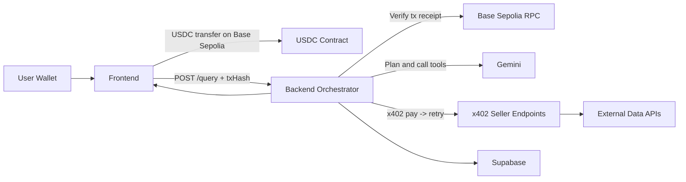
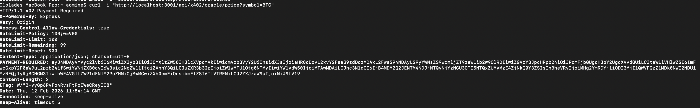
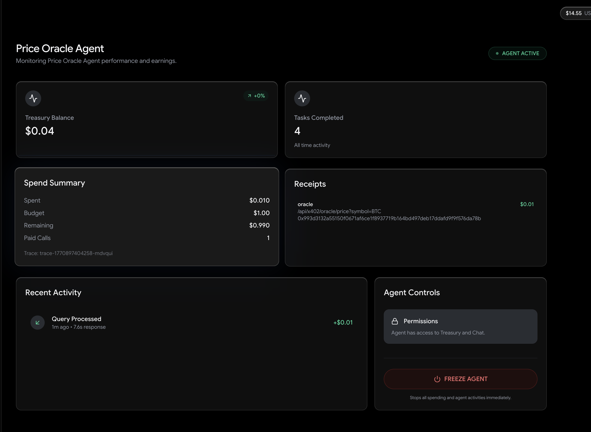
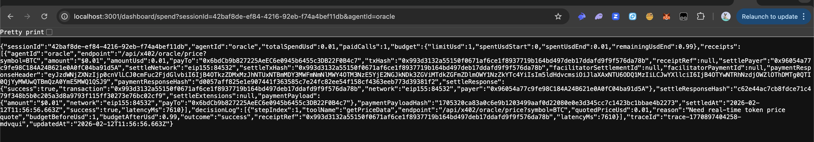

# x402 Agent Marketplace (Arcana)

A full-stack crypto AI orchestration system with:

- paid user chat queries on Base Sepolia (USDC)
- paid internal tool calls via x402 (`HTTP 402 -> pay -> retry`)
- CDP wallet-based buyer/seller wallet management
- policy controls (freeze, spend limits, endpoint/payTo allowlists)
- dashboard observability (receipts, spend, activity, traces)


## Table of Contents

1. What This Project Does
2. Repository Structure
3. End-to-End Flow
4. Services and Responsibilities
5. Agent Catalog
6. Prerequisites
7. Local Setup
8. Environment Variables
9. Supabase Setup
10. API Reference
11. Admin/Policy Controls
12. x402 Audit Evidence
13. Contract Deployment (Base Sepolia)
14. Production Hardening
15. Troubleshooting
16. Commands Reference

## What This Project Does

This project is a multi-agent crypto intelligence app where:

1. A user asks a question in chat.
2. The frontend sends a USDC payment transaction (Base Sepolia).
3. The backend verifies that payment.
4. The backend uses Gemini to decide which specialist tools to call.
5. Paid tools are called through x402 seller routes.
6. The response and payment evidence are logged and returned.

## Repository Structure

```text
x402/
├── backend/                    # Express + TypeScript orchestrator
│   ├── src/
│   ├── scripts/
│   ├── supabase-schema.sql
│   ├── supabase-query-logs.sql
│   ├── supabase-ratings.sql
│   └── supabase-agent-policy.sql
├── arc-agent-hub/              # React + Vite frontend
│   └── src/
├── src/                        # Solidity contracts (Foundry)
├── script/                     # Foundry scripts
├── test/                       # Foundry tests
├── foundry.toml
└── README.md
```

## End-to-End Flow



## Services and Responsibilities

### Frontend (`arc-agent-hub`)

- wallet connection and chain switching
- user payment transaction submission (`$0.03` USDC)
- query submission and chat rendering
- providers dashboard and policy UI (freeze/reactivate)

### Backend (`backend`)

- verifies user payment transaction receipt
- runs Gemini orchestration logic
- executes paid x402 calls to agent endpoints
- enforces policy controls (freeze/limits/allowlists)
- persists chats, spend, receipts, traces, and ratings

### Smart Contracts (`src`, `script`, `test`)

- PolicyVault, Escrow, AgentRegistry
- deployment support for Base Sepolia

## Agent Catalog

| Agent ID | Name | Price |
|---|---|---|
| `oracle` | Price Oracle | `$0.01` |
| `scout` | Chain Scout | `$0.01` |
| `news` | News Scout | `$0.01` |
| `yield` | Yield Optimizer | `$0.01` |
| `tokenomics` | Tokenomics Analyzer | `$0.02` |
| `nft` | NFT Scout | `$0.02` |
| `perp` | Perp Stats | `$0.02` |

x402 route prefix:

- `/api/x402/*`

Examples:

- `/api/x402/oracle/price`
- `/api/x402/news/latest`
- `/api/x402/scout/analyze`
- `/api/x402/yield/top`
- `/api/x402/tokenomics/analyze`
- `/api/x402/scout/nft/:slug`
- `/api/x402/perp/markets`

## Prerequisites

- Node.js 18+
- npm
- Base Sepolia wallet
- test ETH (gas)
- test USDC (Base Sepolia)
- Supabase project (recommended)
- Gemini API key
- CDP API key pair (recommended for wallet provisioning/signing)

## Local Setup

### 1) Install dependencies

```bash
cd /Users/aomine/Desktop/x402/backend
npm install

cd /Users/aomine/Desktop/x402/arc-agent-hub
npm install
```

### 2) Configure backend env

Create:

- `/Users/aomine/Desktop/x402/backend/.env`

Use the template below.

### 3) Configure frontend env

Create:

- `/Users/aomine/Desktop/x402/arc-agent-hub/.env`

Use the template below.

### 4) Run Supabase SQL

Run in this order:

1. `backend/supabase-schema.sql`
2. `backend/supabase-query-logs.sql`
3. `backend/supabase-ratings.sql`
4. `backend/supabase-agent-policy.sql`

### 5) Start backend

```bash
cd /Users/aomine/Desktop/x402/backend
npm run dev
```

Default backend URL: `http://localhost:3001`

Health check: `GET http://localhost:3001/health`

### 6) Start frontend

```bash
cd /Users/aomine/Desktop/x402/arc-agent-hub
npm run dev
```

Default frontend URL: `http://localhost:5173`

## Environment Variables

### Backend `.env` template

```env
# Core runtime
PORT=3001
NODE_ENV=development
ALLOWED_ORIGINS=http://localhost:5173,http://localhost:3000,http://localhost:8080

# Required
PRIVATE_KEY=0x...
GEMINI_API_KEY=...

# Chain + contracts
CHAIN_ID=84532
CHAIN_NAME=Base Sepolia
CHAIN_RPC_URL=https://sepolia.base.org
CHAIN_EXPLORER_URL=https://sepolia.basescan.org
POLICY_VAULT_ADDRESS=0x...
ESCROW_ADDRESS=0x...
AGENT_REGISTRY_ADDRESS=0x...
USDC_ADDRESS=0x036CbD53842c5426634e7929541eC2318f3dCF7e
EURC_ADDRESS=0x89B50855Aa3bE2F677cD6303Cec089B5F319D72a
USYC_ADDRESS=0xe9185F0c5F296Ed1797AaE4238D26CCaBEadb86C

# Supabase
SUPABASE_URL=https://<project>.supabase.co
SUPABASE_ANON_KEY=...

# x402 + CDP
X402_BASE_URL=http://localhost:3001
X402_FACILITATOR_URL=https://www.x402.org/facilitator
X402_DEFAULT_BUDGET_USD=1.00
X402_INIT_TIMEOUT_MS=15000
CDP_API_KEY_ID=...
CDP_API_KEY_SECRET=...
CDP_WALLET_SECRET=...
X402_CDP_WALLET_REGISTRY_PATH=/x402/backend/cdp-wallets.json

# Optional address pins
X402_ORCHESTRATOR_ADDRESS=0x...
ORACLE_X402_ADDRESS=0x...
SCOUT_X402_ADDRESS=0x...
NEWS_X402_ADDRESS=0x...
YIELD_X402_ADDRESS=0x...
TOKENOMICS_X402_ADDRESS=0x...
NFT_SCOUT_X402_ADDRESS=0x...
PERP_STATS_X402_ADDRESS=0x...

# Policy controls
X402_POLICY_DAILY_LIMIT_USD=1.00
X402_POLICY_PER_CALL_LIMIT_USD=0.05
ADMIN_API_KEY=change-me

# Optional external APIs
COINGECKO_API_KEY=
ALCHEMY_API_KEY=
ETHERSCAN_API_KEY=
OPENSEA_API_KEY=
GROQ_API_KEY=

# News tuning
NEWS_API_BASE_URL=https://cryptocurrency.cv
NEWS_API_CACHE_BASE_URL=https://nirholas.github.io/free-crypto-news
NEWS_API_TIMEOUT_MS=5000
NEWS_API_RETRY_COUNT=0

# Deploy script helpers
AGENT_ADDRESS=0x...
DAILY_LIMIT=50
```

### Frontend `.env` template

```env
VITE_API_URL=http://localhost:3001
VITE_PROVIDER_PAY_TO=0x...
VITE_ADMIN_ADDRESS=0x...
VITE_ADMIN_API_KEY=
```

Notes:

- `VITE_*` values are exposed to browser code.
- `VITE_ADMIN_API_KEY` is acceptable for local/demo, not production.

## Supabase Setup

Required files:

- `backend/supabase-schema.sql`
- `backend/supabase-query-logs.sql`
- `backend/supabase-ratings.sql`
- `backend/supabase-agent-policy.sql`

If you see policy-exists errors while re-running old scripts, that usually means the policy already exists.

## API Reference

### Core

- `GET /health`
- `POST /query`
- `GET /providers`
- `GET /dashboard/stats?agentId=...`
- `GET /dashboard/activity?agentId=...&sessionId=...`
- `GET /dashboard/spend?sessionId=...&agentId=...`

### Chat

- `GET /chat/sessions?wallet=...`
- `POST /chat/sessions`
- `DELETE /chat/sessions/:sessionId?wallet=...`
- `GET /chat/sessions/:sessionId/messages`
- `POST /chat/sessions/:sessionId/messages`
- `DELETE /chat/sessions/:sessionId/messages`

### Ratings

- `POST /ratings`
- `GET /ratings/:messageId`
- `GET /agent/rating?agentId=...`
- `GET /agent/response-time?agentId=...`
- `GET /agent/usage-count?agentId=...`

### Admin Policy

- `GET /admin/policy`
- `GET /admin/policy/:agentId`
- `POST /admin/policy/:agentId/freeze` body: `{ "frozen": true|false }`
- `PATCH /admin/policy/:agentId`

If `ADMIN_API_KEY` is set, include header:

- `x-admin-key: <ADMIN_API_KEY>`

Example:

```bash
curl -X POST http://localhost:3001/admin/policy/oracle/freeze \
  -H "Content-Type: application/json" \
  -H "x-admin-key: <ADMIN_API_KEY>" \
  -d '{"frozen":true}'
```

## Admin/Policy Controls

Implemented checks include:

- freeze/unfreeze per agent
- endpoint allowlist checks
- payTo allowlist checks
- per-call spend caps
- daily spend caps
- policy decision logs (`allow`/`deny` with reason)

Providers UI behavior:

- frozen agents remain visible
- frozen agents are sorted to end
- frozen cards show a red slanted `FROZEN` watermark
- frozen cards remain clickable (`Manage`) for reactivation flow

## x402 Audit Evidence

Payment records include rich fields in `x402_payment_logs`, e.g.:

- `receipt_ref`, `tx_hash`
- `facilitator_settlement_id`, `facilitator_payment_id`
- `payment_response_header`
- payload/response hashes (`*_hash`)
- settlement metadata (`settle_payer`, `settle_network`, `settle_tx_hash`)

This supports stronger proof/audit than status-only logs.

## Submission Evidence

### 1) HTTP 402 Challenge



- Endpoint: `GET /api/x402/oracle/price?symbol=BTC`
- Result: `402 Payment Required`

### 2) Payment Success



- User payment verified on Base Sepolia
- Backend confirmed query payment and continued processing

### 3) Trace + Receipt (`/dashboard/spend`)



- Includes per-call receipt fields (`agentId`, `endpoint`, `amountUsd`, `payTo`, `receiptRef/txHash`)
- Demonstrates spend tracking and audit trail

## Contract Deployment (Base Sepolia)

Node deploy script:

- `backend/scripts/deploy-base-sepolia-contracts.mjs`

Run:

```bash
cd /Users/aomine/Desktop/x402/backend
node scripts/deploy-base-sepolia-contracts.mjs
```

Required env for script:

- `PRIVATE_KEY`
- `AGENT_ADDRESS`

Optional but common:

- `CHAIN_RPC_URL`
- `CHAIN_ID`
- `USDC_ADDRESS`
- `DAILY_LIMIT`

Foundry config also exists at repo root (`foundry.toml`) if you prefer Foundry-native flows.

## Production Hardening

1. Remove `VITE_ADMIN_API_KEY` usage.
2. Implement server-side auth + RBAC for admin actions.
3. Tighten `ALLOWED_ORIGINS` to exact domains.
4. Replace permissive Supabase RLS with production policies.
5. Keep secrets server-side and rotate regularly.
6. Add alerts for failed settlements and policy denials.

## Troubleshooting

### Backend unreachable

- confirm backend running on `PORT=3001`
- confirm frontend `VITE_API_URL` matches backend URL
- check `GET /health`

### x402 buyer not ready

- check CDP credentials in backend `.env`
- check RPC/network availability
- restart backend after env changes

### Chat session create/save fails

- verify `SUPABASE_URL` and `SUPABASE_ANON_KEY`
- run SQL setup files
- inspect backend logs for Supabase errors

### Freeze action says too many requests

- backend has rate limiters; restart backend to clear in-memory counters
- ensure dashboard polling and admin limits are configured from latest code

### News endpoints fail intermittently

- primary: `NEWS_API_BASE_URL`
- cache fallback: `NEWS_API_CACHE_BASE_URL`
- tune `NEWS_API_TIMEOUT_MS` and `NEWS_API_RETRY_COUNT`

### Build checks

```bash
cd /Users/aomine/Desktop/x402/backend && npm run build
cd /Users/aomine/Desktop/x402/arc-agent-hub && npm run build
```

## Commands Reference

### Backend

- `npm run dev`
- `npm run build`
- `npm start`

### Frontend

- `npm run dev`
- `npm run build`
- `npm run build:dev`
- `npm run preview`
